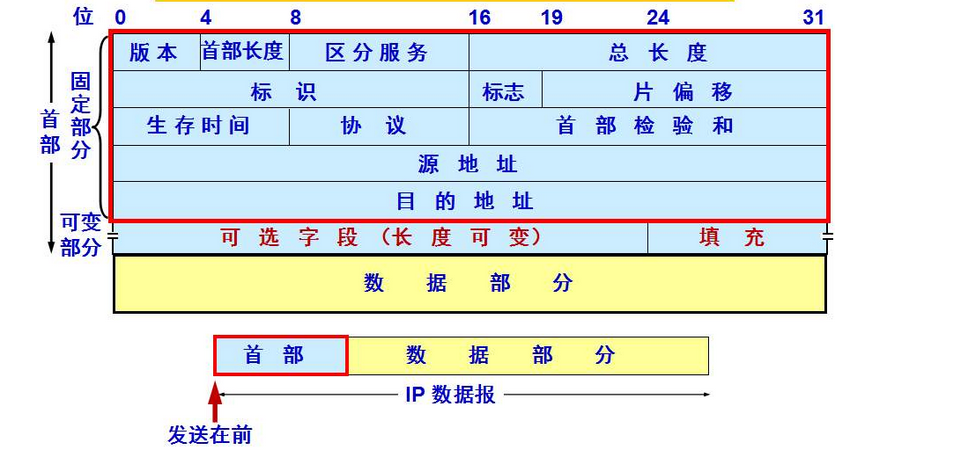

# 网络层
网络层实现于主机与路由器中
## IP 数据报首部
通常是20字节。结构如下

  
 

- 版本号： IPV4 还是 IPV6
- 数据报长度： IP数据报的总长度（包括首部），一般不会超过 1500 字节
- 标识、标志、片位移：与 IP 分片有关
- 寿命；TTL 用来保证不会永远在网络中循环，每当一台路由器处理过该数据报，TTL -1，若 TTL 字段减为0，则直接丢弃

## 路由器
路由器实现了网络层，链路层，物理层
### 路由器结构
输入端口、路由选择处理器、交换结构、输出端口

输入端口、输出端口和交换结构用于实现路由器的转发功能，并且是用硬件实现
### 转发表
转发表是由路由选择处理器计算的，通常会在每个输入端口存放一份副本
## 路由选择算法
因特网自治系统内部的路由选择算法：RIP（距离矢量算法）、OSPF（链路状态算法）

因特网自治系统间的路由选择算法：BGP

## IPv4 编址
每台主机和路由器**接口**都拥有自己的 IP 地址。因此 IP 地址实际上是与接口相关联的。一个接口的 IP 地址的一部分需要由其连接的子网来决定。

IP 地址的非网络前缀部分为全 0 和为全 1 不能用于分配给主机作为 IP 地址，它们有特殊意义

255.255.255.255 是广播 IP 地址，如果主机发送的数据报 目的地址为 255.255.255.255，则该数据报会交付给同一个网络中的所有主机

0.0.0.0：当一台主机还未分配 IP 地址时，它以 0.0.0.0 作为自己的 IP 地址，向 DHCP 服务器请求分配 IP

主机的第一跳路由器的地址称为**默认网关**
### CIDR 编址
形如 a.b.c.d/x，x 指示了网络前缀的位数
### 分类编址
在 CIDR 被采用之前，使用的是分类编址，IP 地址的网络前缀被限制为 8、16、24.

A 类地址：以0开头，网络地址为 8 位，可分配2^24 -2 个 主机 IP 地址

B 类地址：以 10 开头，网络地址为 16 位，可分配 2^16 -2 个 主机 IP 地址，128.0.0.1—191.255.255.254

C 类地址：以 110 开头，网络地址为 24 位，可分配 2^8 -2 个主机 IP 地址 192.0.0.1—223.255.255.254

D 类地址：用于组播，D类地址不分网络地址和主机地址，它的第1个字节的前四位固定为1110。

E 类地址：用于实验，E类地址也不分网络地址和主机地址，它的第1个字节的前五位固定为11110。
### DHCP 协议
是一个**客户-服务器**协议，用于动态分配 IP，客户通常是新到达的主机，服务器是该主机所在子网中的 DHCP 服务器。

DHCP 协议使用的是 UDP
### NAT
- 网络地址转换(NAT),NAT 使用的地址空间为 10.0.0.0/24,这是 RFC 中定义的3部分保留地址之一，用于家庭网络中。
- 使用 NAT 路由器会将家庭网络内部的主机 IP 映射为 NAT 路由器 IP 的一个端口。
- NAT 对P2P 不友好

## IPV6
- 扩大的地址容量：IP 地址长度为 128bit
- 简化高效的 40 字节首部
- 不允许在中将路由器上的分片与组装
