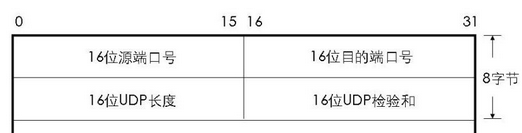
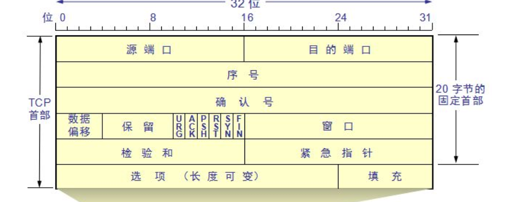

# 运输层服务
- 网络层提供主机间的逻辑通信，而运输层将其扩展为不同进程之间的逻辑通信，使用多路复用与多路分解实现
- 运输层协议是在端系统上实现的
- 应用程序开发人员在生成套接字时应该指定选择 TCP 还是 UDP

## 多路复用与多路分解
运输层没有将数据直接交给应用层进程，而是交给了套接字。由于在任意时刻，在接受主机可能有不止一个套接字，所以每个套接字都有唯一的标识符。
所谓标识，是用来帮助运输层定位：将网络层接收到的分组交给主机的哪一个套接字。
- UDP 套接字是由二元组（目的 IP，目的端口号）来标识的，因此即使源 IP 与源端口号不同的 UDP 报文，如果目的 IP 与目的端口号相同，则两个报文会被定向到同一个 UDP 套接字，因此说 UDP 的连接不是一对一的
- TCP 套接字是由四元组（源 IP，源端口号，目的 IP，目的端口号）标识的。因此说 TCP 的连接是一对一的
- 注意 IP 地址是放在网络层的首部的，运输层的首部不包含 IP 地址

## UDP
- UDP 除了多路复用、多路分解和少量的差错检测外几乎没有对 IP 协议增加其他的东西
- UDP 将来自应用层的数据添加 UDP 首部后，将其交给网络层

  
 

- 只要进程将数据传递给 UDP ，UDP 就会将完整的数据添加 UDP 首部后交给网络层 ———— 面向数据报

## 可靠运输层协议
一个可靠的运输层协议应该提供 差错检测、重传、定时器、序号、确认号等技术

|机  制 |用途和说明|
|------|-------------|
|检验和 |略|
|定时器 |用于超时/重传一个分组|
|序  号 |发送方 向 接受方 发送的分组按规则编号，用于接收方检测是否有分组丢失或分组冗余|
|确认号 |用于接收方告诉发送方，一个/一组分组（取决于协议）已经被正确接受到了。确认可以是逐个的也可以是累计的（取决于协议）|

为了提高传输效率，允许发送方 向 接收方 发送多个分组而不等待确认，这称之为流水线。
解决流水线的差错重传有两种基本方法：回退 N 步、选择重传
### 回退 N 步
允许发送方发送多个分组，而不需要等待确认。但是已发送但未确认的分组数不能超过最大允许数目：N

#### 发送方
- 当准备发送数据时，判断窗口是否已满（即判断是否已经有 N 个已发送但是没有得到确认的分组），若未满，则发送一个分组，若已满，则等待
- 当接受到ACK时，GBN 采用累计确认，因此收到对分组 n 的确认，意味着 n 及 n 之前的分组都已经正确按顺序到达了接收方
- 超时，如果一个分组迟迟没有达到确认，则重传所有已发送但未确认的分组

#### 接收方
- 如果分组 n 到达，并且按序，则为发送方发送分组 n 的确认，将该分组交给上层
- 如果分组 n 不是按序到达或者出错，则直接丢弃分组 n ，向发送方发送最近按序接受道德分组的确认

#### 利弊
可以看出，如果分组 n 未到达接收方，但是 n+1,n+2等分组按序到达了接收方，则最终发送方会因为等待 n 的确认超时而将所有已发送而未确认的分组重新发送。虽然这很愚蠢，但是同时，接收方也不必再缓存失序的分组了。

### 选择重传
- 让发送方仅重传它怀疑出错的分组。因此接收方需要缓存正确但是没有按序到达的分组
- 每个分组有自己的定时器，因此发生重传时只需要发送一个分组
- 不是累计确认

## TCP
- TCP 是面向连接的可靠的运输层协议，为了提供可靠数据传输，TCP 采用了 差错检测、重传、累计确认、定时器，以及用于序号和确认号的首部字段
- TCP 的面向连接是对应用层而言的，而对于运输层的下层而言，是透明的
- TCP 是点对点双全工的，因此 多播（一个发送方将数据发给多个接收方）对 TCP 是不可能的，只能通过多条 TCP 连接实现
- 进程将数据传递给 TCP 后，TCP 会将发送数据存放到发送缓存，并在需要的时候以报文段发送。因此进程一次给 TCP 的数据，可能会被 TCP 分多次交给网络层 ———— 面向字节流
- 一般 TCP 报文最大长度是 1500 字节，而 TCP + IP 首部通常是 40 字节，因此 TCP 报文段中应用层的数据的最大值为 1460 字节
- TCP 首部是 20 字节，包括：

  
 

- 序号: TCP 将数据看成无结构有序的字节流，序号即是该报文段的首字节的字节流编号。TCP 建立连接的时候会先随机生成一个起始序号
- 确认号： 接收方希望接收到已经按序到达的字节流的下一个字节的序号。 即**TCP 提供的是累积确认**，TCP 协议没有规定对失序到达的报文的处理
- 标志字段URG,ACK,PSH,RST,SYN,FIN

### TCP的其他机制
- 超时间隔加倍
TCP 每次重传时，都会将下一次的超时间隔设为之前的两倍
- 快速重传
TCP 采取的是累计确认机制。如果一个比期望序号大的报文到达，则发送方会发送一个冗余 ACK（再次确认某个报文段的 ACK），一旦发送方接收到三个一样的冗余 ACK，则发送方快速重传 冗余 ACK 指示的报文段
- 流量控制
是为了消除发送方使接收方的接收缓存移除的情况，避免发送方发送太快而接收方来不及处理
- 拥塞控制
是为了处理整个网络的拥塞。
TCP 采用了端到端的拥塞控制（因为 IP 层不会向端系统提供网络拥塞的反馈信息），将 TCP 报文段的丢失看作网络拥塞的迹象。
- 慢启动：初始时拥塞窗口为 1 个 MSS，每当接收到一个确认时，将拥塞窗口 + 1 MSS。即每过一个 RTT ，将拥塞窗口×2.慢启动阶段拥塞窗口呈指数增长。当遇到第一个丢包事件，将慢启动阈值定位当前拥塞窗口的一半，然后将拥塞窗口置为 1 MSS，并重新开始慢启动
- 线性增长：当慢启动到拥塞窗口等于慢启动阈值时，每过一个 RTT 将拥塞窗口 +1 MSS，这个阶段称为线性增长
- 线性增长结束：线性增长阶段，当遇到第一个丢包事件，将慢启动阈值定位当前拥塞窗口的一半，然后将拥塞窗口置为 1 MSS，并重新开始慢启动

## TCP 对比 UDP
- TCP面向连接，UDP面向非连接
- TCP提供可靠的服务（数据传输），UDP无法保证
- TCP面向字节流，UDP面向报文
- TCP数据传输慢，UDP数据传输快
- TCP有拥塞控制机制和流量控制机制
- TCP首部20字节，UDP首部8字节

# 三次握手与四次挥手
https://blog.csdn.net/qq_38950316/article/details/81087809  
https://www.cnblogs.com/charlesblc/p/5427527.html  
https://www.cnblogs.com/zedosu/p/6710167.html  
